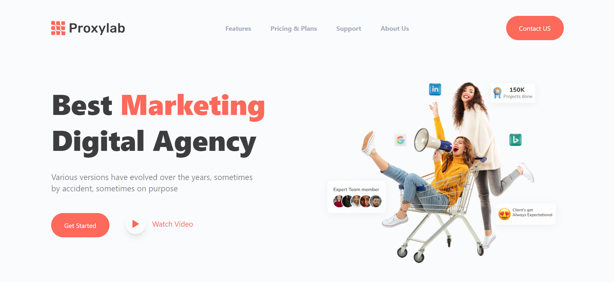

# • ProxyLab App 🚀
This is a web application responsive project has been developed with Next.js and some useful libraries.

 

<h2>• Technologies ⚙️ </h2>

Project is created with:

✨ Next.js   

✨ TailwindCSS

✨ DaisyUi

✨ Typescript

✨ Swiper       

 

<h2>• Features Included 💡: </h2>

 

## • Project Demo 📷

 

## • Live Demo 🖥
Here is a working live demo :  [ProxyLab](https://proxylab-app.vercel.app/)
